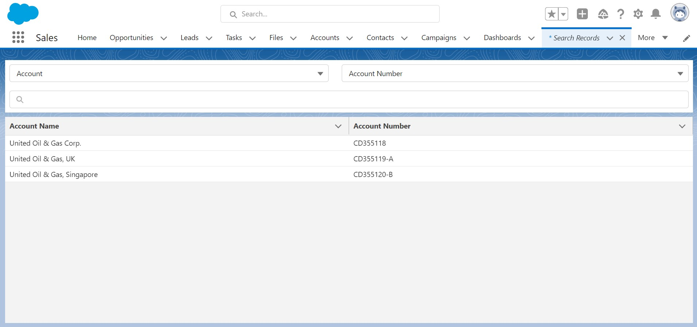
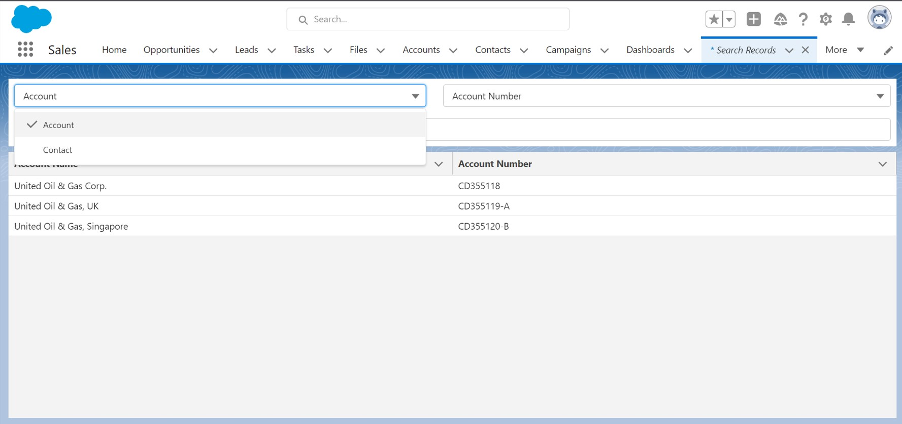
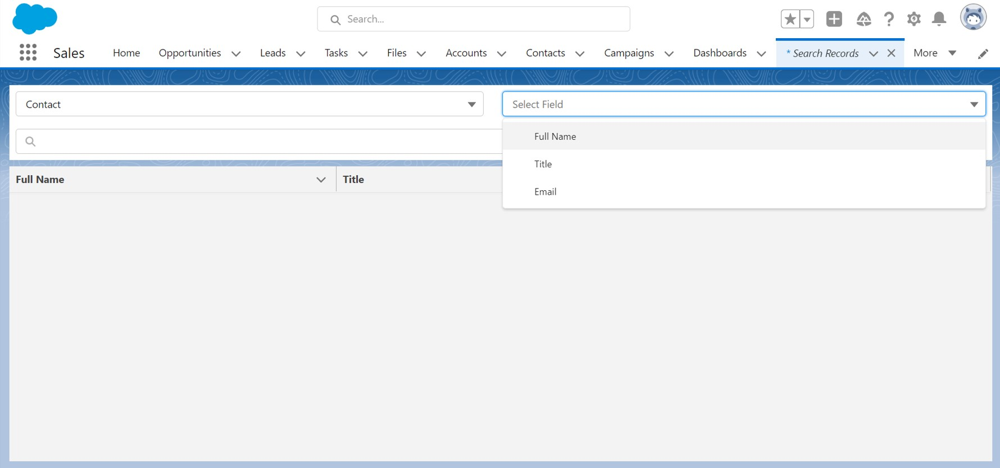
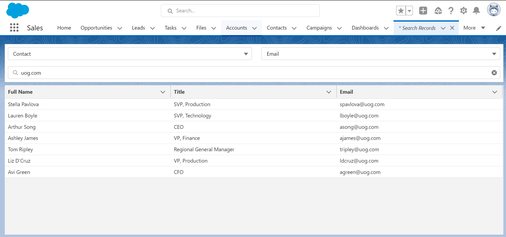

# Dynamic Record Search LWC

This repository contains Salesforce SFDX based project to search records of any object by simple configuration. Lightning Web Components is used to achieve visualization of data and images.

# Glance

# Built With
* Lightning Web Components - Salesforce based web framework
* Apex
* Custom object
